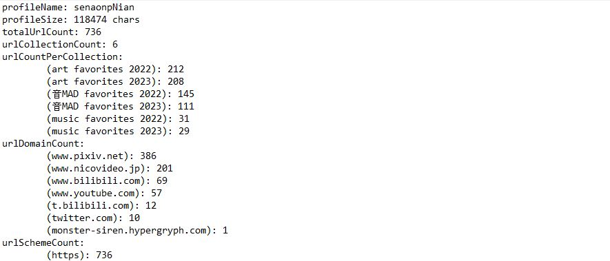

# profile stats generator

## generates data points of user(s)' public profile



------------------

How data is structured:

```
profileName: _____,
profileSize: _____,
totalUrlCount: _____,
urlCollectionCount: _____,
urlCountPerCollection: 
    _____: _____,
    ...
urlDomainCount:
    _____: _____,
    ...
urlSchemeCount:
    _____: _____,
    ...
```

------------------

How to use: 
- set any configurable variables (listed in the "configs" section)
- run `script.py`
- data files should be generated in the set output directory

------------------

Available configurable variables:
- outputDir - the directory to write the output files (default: './output')
- users - a list of usernames (default: ['senaonp', 'senaonpNian'])