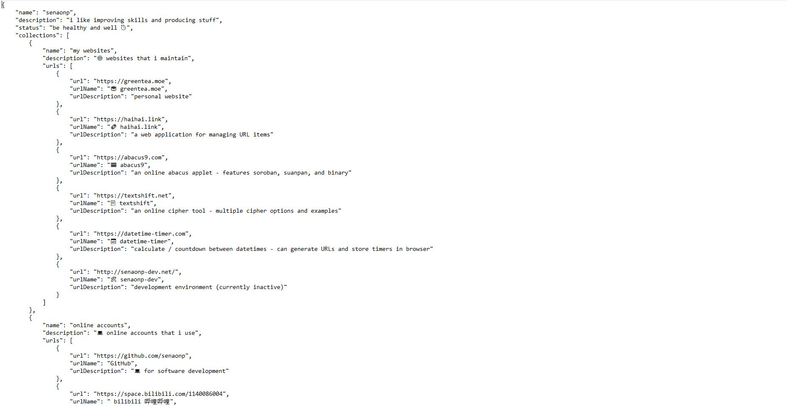

# raw data file generator

## generates JSON files with public information from a given list of usernames



------------------

How to use: 
- set any configurable variables (listed in the "configs" section):
- run `script.py`
- the JSON files should be generated in the set output directory

------------------

How JSON data is structured:

```
{
    "name": _____,
    "description": _____,
    "status": _____,
    "collections": [
        {
            "name": _____,
            "description": _____,
            "urls": [
                {
                    "url": _____,
                    "urlName": _____,
                    "urlDescription": _____
                },
                ...
            ]
        },
        ...
    ]
}
```

------------------

Available configurable variables:
- outputDir - the directory to write the output files (default: './output')
- users - a list of usernames (default: ['senaonp', 'senaonpNian'])