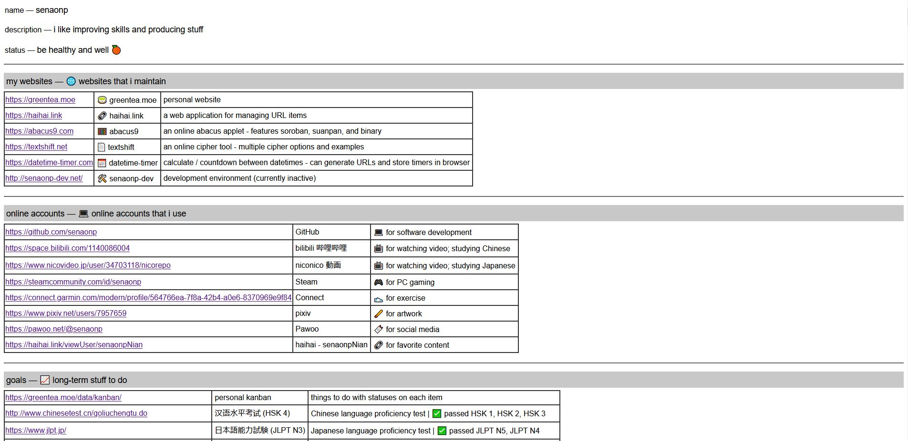

# static website generator

## generates HTML files with public information from a given list of usernames

------------------

How to use: 
- set any configurable variables (listed in the "configs" section):
- run `script.py`
- the html files should be generated in the set output directory

A video demonstration is also available on: https://fbacarisas.xyz/video/#haihai_link_API_website_generator

------------------

Available configurable variables:
- outputDir - the directory to write the output html files (default: './output')
- users - a list of usernames (default: ['senaonp', 'senaonpNian'])